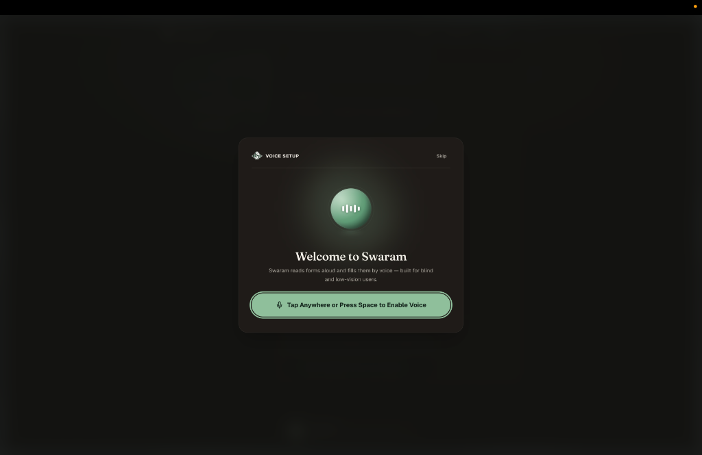
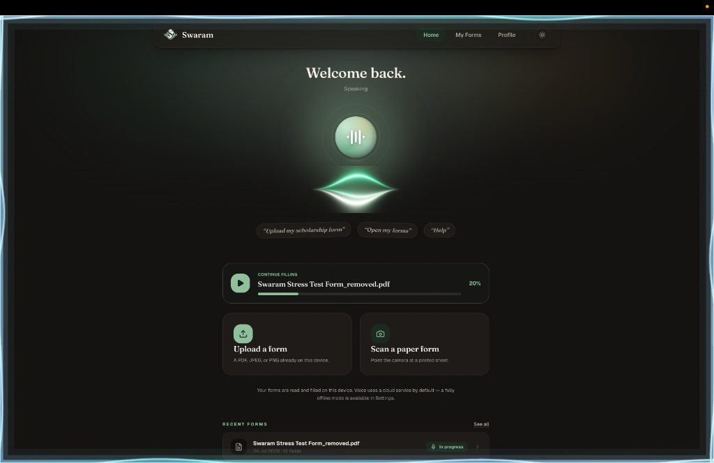
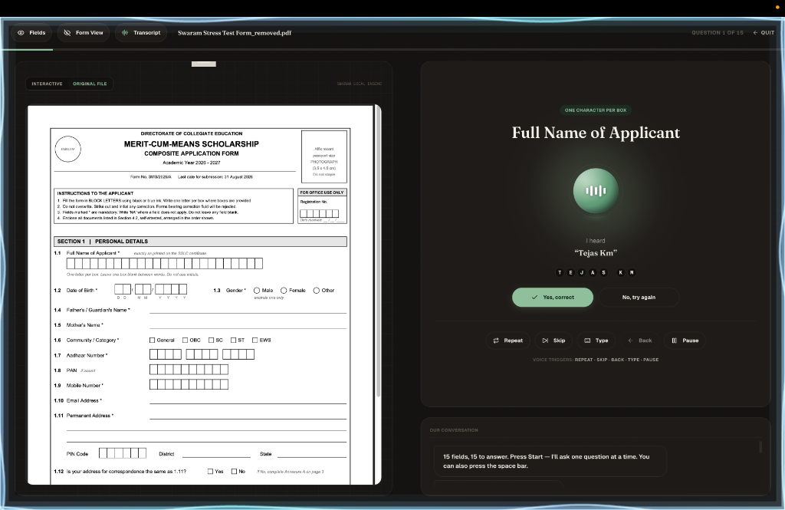
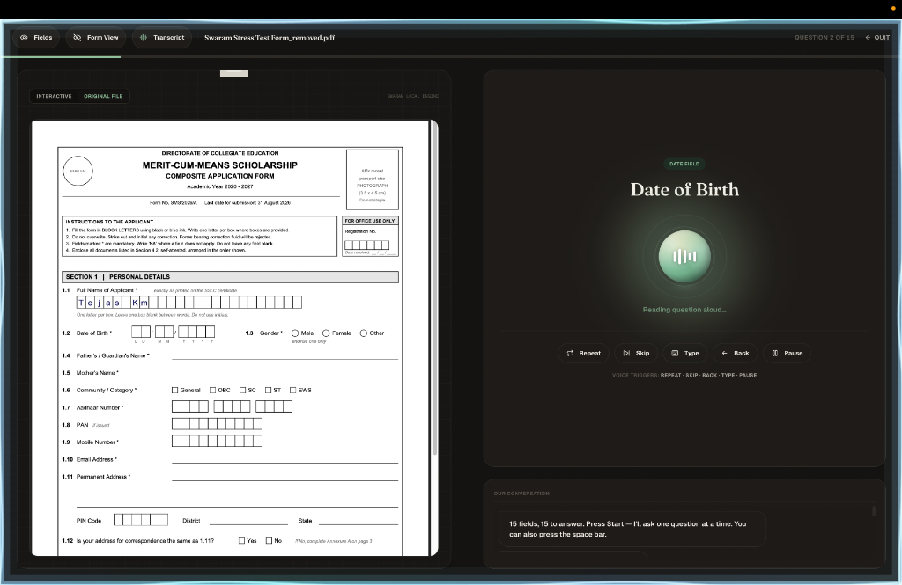
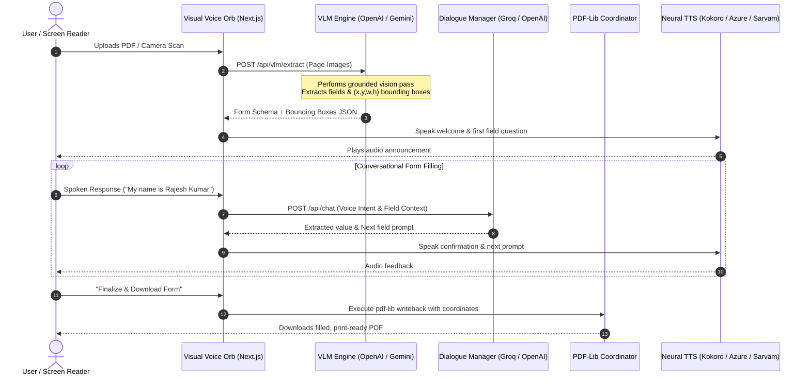

<div align="center">

  <a href="https://swaram-chait.vercel.app/">
    
  </a>

  <h1>SWARAM</h1>
  <h3>Voice-First AI Accessibility Assistant for Forms & Documents</h3>

  <p>
    <b>Empowering blind, low-vision, and motor-impaired users to effortlessly navigate, fill out, and verify complex forms through fluid voice interaction.</b>
  </p>

  <p>
    <a href="https://swaram-chait.vercel.app/"><strong>Try Live App »</strong></a>
    &nbsp;•&nbsp;
    <a href="#quickstart"><strong>Quickstart</strong></a>
    &nbsp;•&nbsp;
    <a href="#visual-voice-orb-experience"><strong>Voice Orb States</strong></a>
    &nbsp;•&nbsp;
    <a href="#hybrid-ai-suite--technical-stack"><strong>Hybrid AI Suite</strong></a>
    &nbsp;•&nbsp;
    <a href="#system-architecture--data-flow"><strong>Architecture</strong></a>
  </p>

  <br />

  <!-- Badges -->
  <p>
    <a href="https://swaram-chait.vercel.app/"></a>
    
    
    
    
  </p>

  <p>
    
    
    
    
    
  </p>

</div>

---

## Overview

**SWARAM** (*Sound / Voice* in Sanskrit & Indian languages) is an accessible, voice-first companion designed to eliminate digital accessibility barriers. Filing government applications, healthcare intakes, or financial disclosures can be daunting—especially for visually impaired users.

SWARAM turns static, complex PDFs into **conversational voice dialogues**. Powered by a hybrid engine of cutting-edge **Vision Language Models (VLMs)**, **Multilingual Speech Synthesis & Recognition**, and **on-device PDF coordinate manipulation**, SWARAM reads forms aloud, asks targeted questions step-by-step, validates inputs, and stamps precise fields back onto the original document.

> *Designed with inspiration from Wispr Flow, Apple Intelligence, and Arc Browser—SWARAM replaces intimidating SaaS dashboards with a calm, liquid ambient voice interface.*

---

## Application Interface & Live Showcase

<div align="center">
  
  <p><i>Figure 1: SWARAM Voice Setup & Onboarding Overlay featuring the interactive ambient Voice Orb.</i></p>
  <br /><br />
  
  <p><i>Figure 2: Main Conversational Workspace with Speaking state, quick voice prompts, and document ingestion cards.</i></p>
  <br /><br />
  
  <p><i>Figure 3: Interactive Voice Form Filling featuring step-by-step spoken dialogue, transcript confirmation, and PDF split view.</i></p>
  <br /><br />
  
  <p><i>Figure 4: Real-Time Document Coordinate Writeback — Stamping individual character inputs directly into original form boxes via pdf-lib.</i></p>
</div>

---

## Visual Voice Orb Experience

The central interaction hub of SWARAM is the **Visual Voice Orb**—an interactive WebGL/OGL ambient canvas that reacts dynamically to voice input, processing phases, and audio output.

<table align="center" width="100%">
  <thead>
    <tr>
      <th width="15%">Visual State</th>
      <th width="20%">Orb Behavior & Easing</th>
      <th width="40%">Visual Animation & Color Spectrum</th>
      <th width="25%">Accessibility & ARIA Live</th>
    </tr>
  </thead>
  <tbody>
    <tr>
      <td align="center">
        <b>IDLE</b>
      </td>
      <td>Calm ambient pulse<br /><code>1200ms</code> slow loop</td>
      <td>
        <div style="background: linear-gradient(135deg, #059669, #10B981); padding: 10px; border-radius: 8px; color: white; text-align: center; font-weight: bold;">
          Emerald Green Glow
        </div>
        <p><i>Soft concentric halo breathing gently. Signals readiness for voice activation.</i></p>
      </td>
      <td><code>aria-live="polite"</code><br />"Assistant ready. Tap or say Hello."</td>
    </tr>
    <tr>
      <td align="center">
        <b>LISTENING</b>
      </td>
      <td>Concentric wave expansion<br />Fast reactive spring</td>
      <td>
        <div style="background: linear-gradient(135deg, #2563EB, #3B82F6); padding: 10px; border-radius: 8px; color: white; text-align: center; font-weight: bold;">
          Sapphire Blue Ripples
        </div>
        <p><i>Real-time audio frequency ripples scaling with mic input volume.</i></p>
      </td>
      <td><code>aria-live="assertive"</code><br />"Listening to your response..."</td>
    </tr>
    <tr>
      <td align="center">
        <b>PROCESSING</b>
      </td>
      <td>Rotating liquid gradient<br />Shimmer rotation</td>
      <td>
        <div style="background: linear-gradient(135deg, #7C3AED, #A855F7); padding: 10px; border-radius: 8px; color: white; text-align: center; font-weight: bold;">
          Violet Model Ring
        </div>
        <p><i>Rotating gradient rings reflecting VLM field extraction or LLM intent parsing.</i></p>
      </td>
      <td><code>aria-live="polite"</code><br />"Processing form data..."</td>
    </tr>
    <tr>
      <td align="center">
        <b>SPEAKING</b>
      </td>
      <td>Expanding wave propagation<br />Dynamic frequency sync</td>
      <td>
        <div style="background: linear-gradient(135deg, #D97706, #F59E0B); padding: 10px; border-radius: 8px; color: white; text-align: center; font-weight: bold;">
          Amber Liquid Spectrum
        </div>
        <p><i>Pulsing audio visualizer synced to TTS audio amplitude playback.</i></p>
      </td>
      <td><code>aria-live="off"</code><br />(Audio playback active)</td>
    </tr>
  </tbody>
</table>

---

## Hybrid AI Suite & Technical Stack

SWARAM combines high-precision cloud AI APIs for vision and speech with efficient client-side document processing for absolute coordinate writebacks.

```
                  ┌─────────────────────────────────────────────────────────┐
                  │                 CLOUD AI INTEGRATIONS                   │
                  │  ┌──────────────────┐    ┌───────────────────────────┐  │
                  │  │ VLM Vision Pass  │    │ Multi-Lingual Speech Suite│  │
                  │  │ OpenAI GPT-5.5   │    │ Sarvam AI (Indian STT/TTS)│  │
                  │  │ Gemini Flash VLM │    │ Groq Whisper & Llama 70B  │  │
                  │  └────────┬─────────┘    │ Azure Neural Speech SDK   │  │
                  └───────────┼──────────────└─────────────┬─────────────┘  │
                              │                            │                │
┌─────────────────────────────┼────────────────────────────┼────────────────┴───────────┐
│ CLIENT / BROWSER RUNTIME    │                            │                            │
│                             ▼                            ▼                            │
│ ┌──────────────────────────────┐              ┌──────────────────────────────┐        │
│ │   DOCUMENT INGESTION & CV    │              │   VOICE ASSISTANT ENGINE     │        │
│ │ - PDF.js Page Renderer       │              │ - Web Speech Recognition API │        │
│ │ - Tesseract.js (WASM OCR)    │              │ - Server Kokoro Neural TTS   │        │
│ │ - OpenCV.js Shape Detector   │              │ - Framer Motion Visual Orb   │        │
│ └──────────────┬───────────────┘              └──────────────┬───────────────┘        │
│                │                                             │                        │
│                └──────────────────────┬──────────────────────┘                        │
│                                       ▼                                               │
│                        ┌──────────────────────────────┐                               │
│                        │     CLIENT FORM WRITEBACK    │                               │
│                        │  pdf-lib (Exact Coordinates) │                               │
│                        │  Fuse.js Profile Autofill    │                               │
│                        └──────────────────────────────┘                               │
└───────────────────────────────────────────────────────────────────────────────────────┘
```

### AI Component Breakdown

| Layer | Technology / Service | Role & Function |
| :--- | :--- | :--- |
| **Grounded VLM Vision** | **OpenAI GPT-5.5** / **Google Gemini Flash** | Grounded 1-pass visual layout extraction. Reads field names, input types, radio options, and exact `(x, y, w, h)` bounding boxes per page. |
| **Indian Languages Speech** | **Sarvam AI** (Saaras & Speech APIs) | Real-time WebSocket Speech-to-Text, Translation, Transliteration, and Natural TTS for Hindi, Malayalam, Tamil, Kannada, and regional Indian languages. |
| **Low-Latency LLM & STT** | **Groq** (`llama-3.3-70b`, `whisper-large-v3-turbo`) | Ultra-fast conversational dialogue management, intent classification, and transcription fallback. |
| **Neural Text-to-Speech** | **Kokoro Neural Server TTS** / **Azure Speech** | High-fidelity, natural-sounding voice playback (300-500MB server model + studio-grade Azure Speech voices). |
| **Client Document Engine** | **pdf-lib**, **pdfjs-dist**, **tesseract.js**, **opencv.js** | Client-side WASM document rendering, OCR fallback, bounding-box clustering, and coordinate-precise PDF stamping. |
| **Local Profile Matching** | **Fuse.js** | Client-side fuzzy matching for auto-filling saved user demographics (Name, Address, Aadhaar/PAN, DOB) securely. |

---

## System Architecture & Data Flow



---

## Key Features & Capabilities

- **Voice-First Conversational Interface**: Complete hands-free workflow with multi-turn voice interaction, instant confirmation, and error correction.
- **Grounded VLM Vision Analysis**: High-precision field recognition for complex, unformatted, or scanned document images using OpenAI GPT-5.5 & Gemini Flash.
- **Deep Multilingual Support**: First-class support for Indian languages (Hindi, Malayalam, Tamil, etc.) powered by Sarvam AI alongside global languages via Azure & Kokoro.
- **Coordinate-Precise PDF Stamping**: Stamped text, checkmarks, and signatures are written into exact document coordinates using `pdf-lib`.
- **WCAG 2.1 AA Compliant UI**: Built from the ground up with high contrast (4.5:1+), 44px+ touch targets, keyboard focus traps, and real-time `aria-live` screen-reader region updates.
- **Privacy-Minded Local Profile Storage**: User profiles and government identifiers remain stored safely in local browser storage via `fuse.js`.

---

## Quickstart

### Prerequisites
- **Node.js**: `18.18.0` or higher
- **Package Manager**: `npm` / `pnpm` / `bun`

### 1. Clone & Install Dependencies

```bash
git clone https://github.com/Chai-T-ORG/swaram.git
cd swaram
npm install
```

### 2. Configure Environment Variables

Create a `.env.local` file in the root directory:

```bash
cp .env.example .env.local
```

Populate the required API keys:

```env
# Vision Language Models (VLM)
OPENAI_API_KEY=your_openai_api_key
OPENAI_VLM_MODEL=gpt-5.5

# Alternative VLM Provider
GEMINI_API_KEY=your_gemini_api_key
VLM_MODEL=gemini-flash-latest

# Multilingual Voice & Speech (Optional / Recommended)
SARVAM_API_KEY=your_sarvam_api_key
GROQ_API_KEY=your_groq_api_key
AZURE_SPEECH_KEY=your_azure_speech_key
AZURE_SPEECH_REGION=centralindia
```

### 3. Run Development Server

```bash
npm run dev
```

Open [http://localhost:3000](http://localhost:3000) with your browser to experience SWARAM.

### 4. Optional: Run WebSocket STT Relay

For real-time Sarvam AI WebSocket streaming:

```bash
npm run stt:relay
```

---

## Accessibility & WCAG Compliance Checklist

SWARAM is engineered with strict adherence to accessibility standards:

| WCAG Criteria | Implementation in SWARAM | Status |
| :--- | :--- | :--- |
| **1.4.3 Contrast (Minimum)** | High-contrast warm cream (`#FDFBF7`) & forest green (`#052E16`) color palette with > 7:1 ratio. | `COMPLIANT` |
| **2.1.1 Keyboard Accessible** | Full tab ordering, visible outline states, and shortcut keys for all actions. | `COMPLIANT` |
| **2.5.5 Target Size** | All interactive touch targets exceed the 44px x 44px minimum recommendation. | `COMPLIANT` |
| **4.1.2 Name, Role, Value** | Semantic HTML5 structure with custom ARIA live regions for active voice states. | `COMPLIANT` |
| **2.3.1 Three Flashes / Reduced Motion** | Respects `prefers-reduced-motion` globally across Framer Motion animation tiers. | `COMPLIANT` |

---

## Repository Structure

```
swaram/
├── app/                        # Next.js 16 App Router
│   ├── api/                    # Serverless API Routes
│   │   ├── chat/               # Conversational LLM Intent Handler
│   │   ├── sarvam/             # Sarvam AI STT/TTS & Relay
│   │   ├── speech/             # Speech Recognition Fallbacks
│   │   ├── tts/                # Kokoro / Azure / Google TTS Engine
│   │   └── vlm/                # Vision Language Model Form Extraction
│   ├── layout.tsx              # Root Layout & Accessibility Providers
│   └── page.tsx                # Main Conversational Workspace
├── components/                 # React 19 UI & Motion Components
│   ├── onboarding/             # Progressive Voice-First Onboarding Flow
│   ├── screens/                # Workflow Screens (Upload, Fill, Review)
│   ├── ui/                     # Accessible Base UI Primitives
│   └── VoiceOrb.tsx            # OGL WebGL Ambient Visual Voice Canvas
├── lib/                        # Core Utilities & AI Orchestration
│   ├── analysis/               # VLM Prompts & Document Field Parser
│   ├── ocr/                    # WASM Tesseract.js & OpenCV Pipelines
│   ├── pdf/                    # pdf-lib Coordinate Writer & PDF.js
│   └── voice/                  # Web Speech & Audio Stream Handlers
├── public/                     # Static Assets & WASM Binary Modules
│   └── logo.png                # Official SWARAM Brand Logo
└── scripts/                    # WebSocket Relays & Evaluation Harnesses
```

---

## License

Distributed under the MIT License. See `LICENSE` for more information.

---

<div align="center">
  <p>Built with pride by the <b>CHAI-T Team</b></p>
  <p><i>Bringing voice, dignity, and accessibility to modern web applications.</i></p>
</div>
